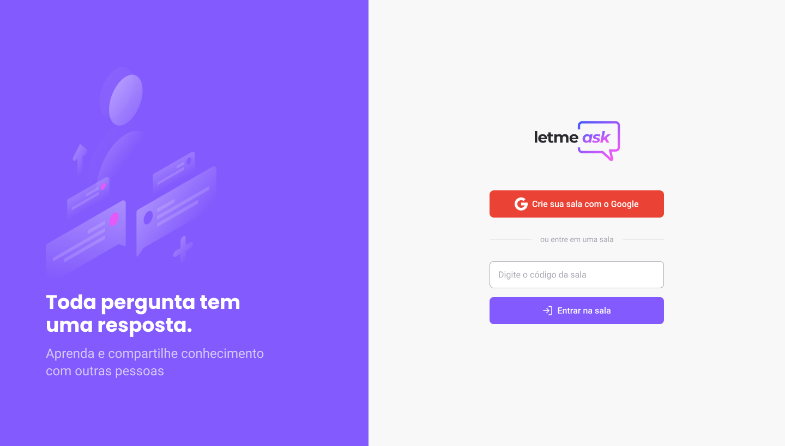

# 
  

## 🚀 Tecnologias

- ReactJS
- Typescript
- ContextAPI
- Hooks
- Firebase Authentication
- Firebase Realtime Database

## 💻 Projeto

O Letmeask é uma aplicação de interação através de salas logadas com perguntas, sendo possível criar uma sala para internautas, para fazerem perguntas e o criador da sala em posse de uma senha gerenciar essas perguntas e marcar como lidas.

#### Desenvolvido por

> ======= Alexsander Telles 🤓 | Desenvolvedor Frontend ♥️ ========<
